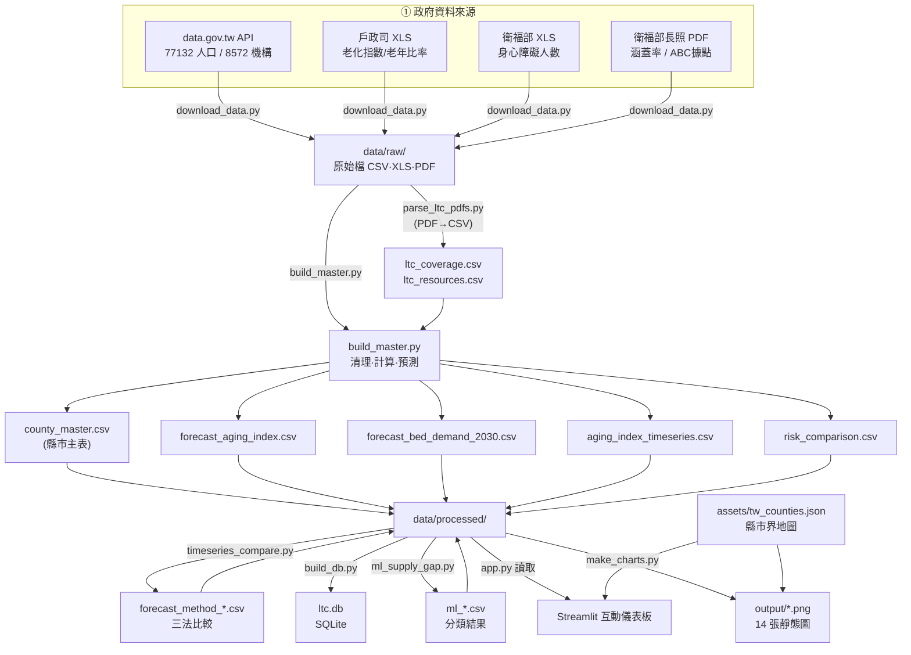
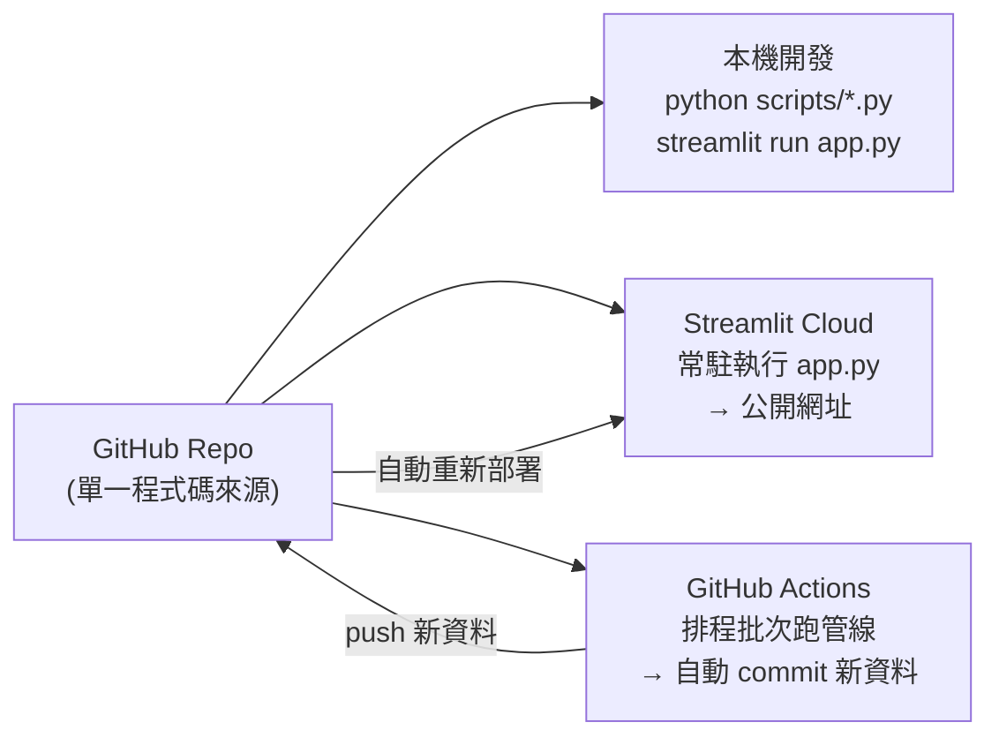
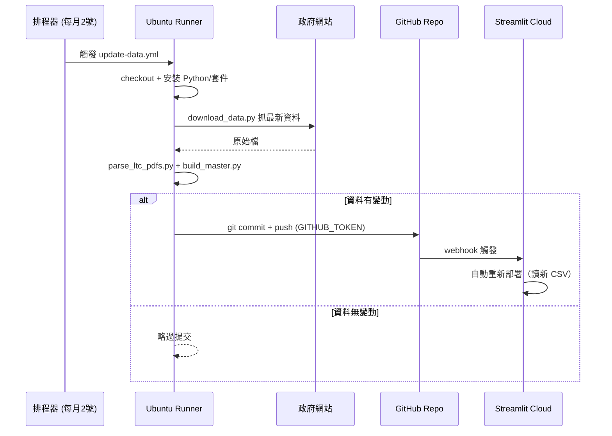
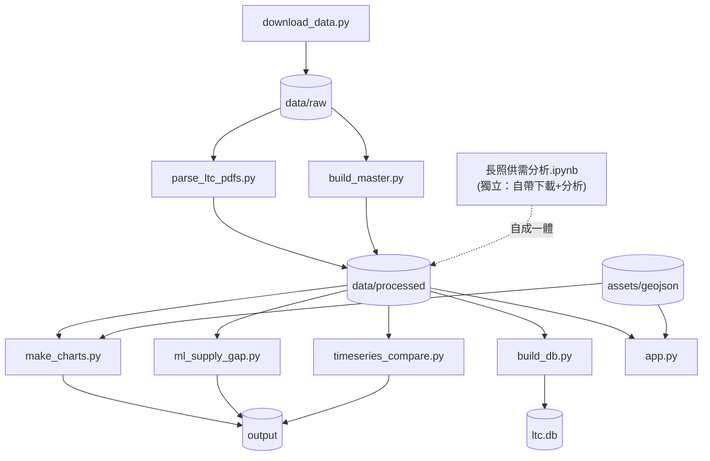

# 架構說明（ARCHITECTURE）

這份筆記記錄整個專案工程面是怎麼運作的：流程、分層、各程式之間怎麼接。
（下面的 Mermaid 圖在 GitHub 上會自動畫成圖；ASCII 圖在哪裡都看得到。）

---

## 1. 分層

整個系統大致分五層，資料單向往下流：來源 → 擷取 → 處理 → 儲存 → 呈現，外加一層自動化。

```
┌─────────────────────────────────────────────────────────────┐
│  ① 資料來源層  內政部戶政司 / 衛福部 (data.gov.tw API、PDF、XLS) │
└───────────────┬─────────────────────────────────────────────┘
                │  HTTP 下載
┌───────────────▼─────────────────────────────────────────────┐
│  ② 擷取層      download_data.py（抓最新、存檔）                  │
└───────────────┬─────────────────────────────────────────────┘
                │  data/raw/*  (CSV / XLS / PDF)
┌───────────────▼─────────────────────────────────────────────┐
│  ③ 處理層      parse_ltc_pdfs.py → build_master.py             │
│               （解析、清理、計算指標、預測）                      │
└───────────────┬─────────────────────────────────────────────┘
                │  data/processed/*.csv  (乾淨資料表)
┌───────────────▼─────────────────────────────────────────────┐
│  ④ 儲存層      data/processed/  +  assets/  （扁平 CSV/JSON）    │
└───────────────┬───────────────────────────┬─────────────────┘
                │ make_charts.py             │ app.py 讀取
┌───────────────▼──────────┐    ┌───────────▼─────────────────┐
│ ⑤a 靜態圖表 output/*.png  │    │ ⑤b 互動儀表板 (Streamlit)     │
└──────────────────────────┘    └─────────────────────────────┘

        ⑥ 自動化層：GitHub Actions 每月觸發 ②→③（見第 4 節）
```

這裡有個原則：原始資料(raw)和處理結果(processed)分開。重的運算（下載、解析、計算、訓練模型）
只在處理層做一次，結果存成扁平 CSV；呈現層（圖表、網站）只讀 CSV、不重算，所以開起來快又穩。

---

## 2. 資料管線（Data Pipeline）



### 管線步驟與輸入輸出（Data Contract）

| 步驟 | 程式 | 輸入 | 輸出 |
|---|---|---|---|
| 1 擷取 | `download_data.py` | 政府網站 | `data/raw/*` |
| 2 解析 | `parse_ltc_pdfs.py` | 2 個長照 PDF | `ltc_coverage.csv`、`ltc_resources.csv` |
| 3 建表 | `build_master.py` | `data/raw/*` + 上述 2 CSV | `county_master.csv` 等 6 個 CSV |
| 4 繪圖 | `make_charts.py` | `data/processed/*` + geojson | `output/*.png`（01–11） |
| 5 建庫 | `build_db.py` | `data/processed/*` | `ltc.db`（SQLite） |
| 6 模型 | `ml_supply_gap.py` | `county_master.csv` | `ml_*.csv` + 圖 12、13 |
| 7 預測比較 | `timeseries_compare.py` | `aging_index_timeseries.csv` | `forecast_method_*.csv` + 圖 14 |
| 8 服務 | `app.py` | `data/processed/*` + geojson | 網頁（即時） |

---

## 3. 執行時環境（Runtime）— 同一份程式碼，三種跑法



| 環境 | 角色 | 觸發 | 跑什麼 |
|---|---|---|---|
| **本機** | 開發/分析 | 手動 | 全部（notebook、腳本、app） |
| **Streamlit Cloud** | 線上服務 | 有人開網址 | 只跑 `app.py`（讀 processed CSV） |
| **GitHub Actions** | 排程更新 | 每月 / 手動 | 跑 download→parse→build（不跑 app） |

> 關鍵：三個環境**共用同一份 GitHub 程式碼**。本機改 → push → Cloud 自動更新；Actions 跑出新資料 → push → Cloud 自動更新。形成閉環。

---

## 4. CI/CD 自動更新流程（GitHub Actions）



`.github/workflows/update-data.yml` 重點設定：
- `on.schedule.cron: "0 20 1 * *"` → 每月 1 號 UTC 20:00 ＝ 台灣每月 2 號 04:00
- `on.workflow_dispatch` → 可在網頁手動觸發
- `permissions.contents: write` → 允許 Action 自動 commit/push（需在 repo Settings 開啟 Read and write）
- 末步用 `git diff --staged --quiet` 判斷**有變動才 commit**，避免空提交

---

## 5. 模組相依關係



- `build_master.py` 是樞紐，指標和預測都在這裡算。
- `ml_supply_gap.py`、`timeseries_compare.py`、`build_db.py` 都只吃 processed CSV，彼此獨立，少跑一支不會影響其他。
- `長照供需分析.ipynb` 是可以單獨跑的版本（自己下載、清理、畫圖、做模型），不依賴上面腳本，方便交報告。

---

## 6. 技術堆疊（Tech Stack）

| 層 | 技術 | 用途 |
|---|---|---|
| 語言 | Python 3.12 | 全專案 |
| 資料處理 | pandas, numpy | 清理、彙總、指標、迴歸 |
| 檔案解析 | xlrd / openpyxl（XLS/XLSX）、pdfplumber（PDF）| 讀政府各式格式 |
| 靜態視覺化 | matplotlib | output/*.png（含手繪 choropleth） |
| 互動視覺化 | Streamlit + Plotly | 線上儀表板 |
| 機器學習 | scikit-learn | 供給不足分類（邏輯迴歸/決策樹/隨機森林） |
| 資料庫 | sqlite3（標準庫） | 把 processed CSV 灌進 SQLite，用 SQL 查 |
| 取得資料 | urllib（標準庫）| 下載，含並行掃描最新月份 |
| 版本控制/CI | Git + GitHub Actions | 自動更新 |
| 部署 | Streamlit Community Cloud | 公開網址 |

---

## 7. 幾個寫法上的選擇

- **raw / processed 分離**：重運算只做一次，網站只讀結果，所以快、穩、也能離線展示。
- **下載獨立成一支腳本**：「更新資料」和「重算分析」分開，排程才好單獨呼叫。
- **路徑用 `os.path…__file__` 相對定位**：本機 Windows 和 CI 的 Linux 同一份程式都能跑。一開始寫死 `C:\` 路徑，結果 CI 掛掉，才改掉。
- **下載最新月份用 `read(2500)` 並行掃描**：政府 API 不一定支援 Range，只讀前段避免整檔下載，一百多期平行掃幾秒就好。
- **每個下載來源各自 try/except**：單一政府網站當掉，不會把整條管線拖垮。
- **預測主軸用線性迴歸**：資料點少、趨勢接近直線，簡單又好解釋；另外用 CAGR、移動平均做回測對照（見 `timeseries_compare.py`）。
- **機器學習特徵避免洩漏**：分類「供給不足」時，特徵不放涵蓋率本身或由它算出來的欄位，否則等於偷看答案。
- **指標 z-score 後再合成**：不同單位（%、比率）不能直接相加。
- **CSV 存檔用 `utf-8-sig`**：Excel 開中文才不會亂碼。
