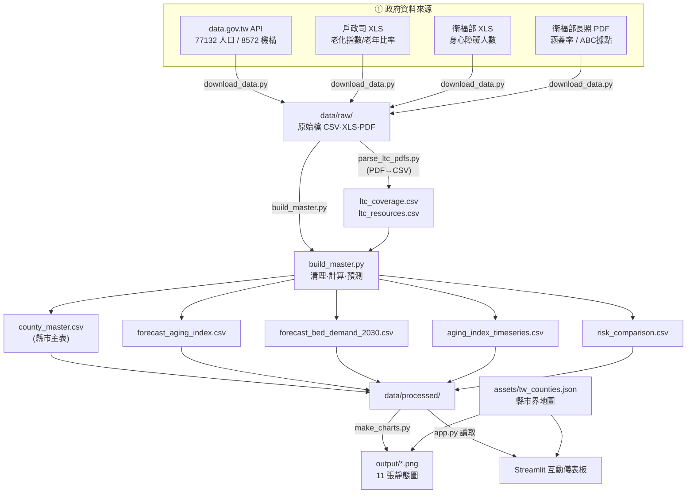
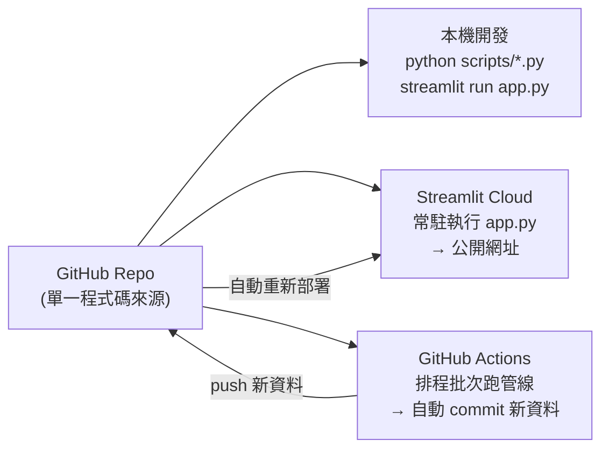
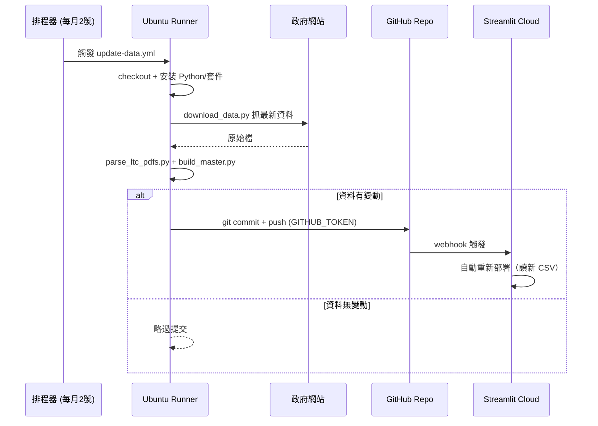
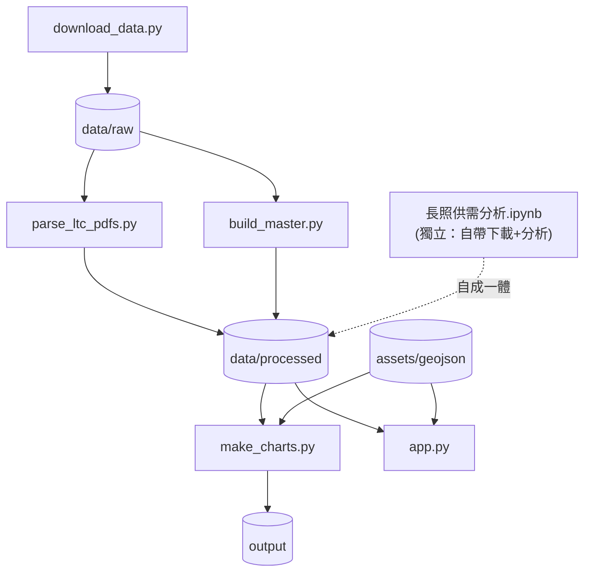

# 系統架構文件（ARCHITECTURE）

台灣長照供需分析 — 工程面的運作方式、流程與架構。

> 本文的 Mermaid 圖在 GitHub 上會自動渲染成圖形；ASCII 圖在任何環境都看得到。

---

## 1. 高層架構（分層）

整個系統分成五層，資料**單向往下流**：來源 → 擷取 → 處理 → 儲存 → 呈現，外加一層自動化。

```
┌─────────────────────────────────────────────────────────────┐
│  ① 資料來源層  內政部戶政司 / 衛福部 (data.gov.tw API、PDF、XLS) │
└───────────────┬─────────────────────────────────────────────┘
                │  HTTP 下載
┌───────────────▼─────────────────────────────────────────────┐
│  ② 擷取層      download_data.py（抓最新、存檔）                  │
└───────────────┬─────────────────────────────────────────────┘
                │  data/raw/*  (CSV / XLS / PDF)
┌───────────────▼─────────────────────────────────────────────┐
│  ③ 處理層      parse_ltc_pdfs.py → build_master.py             │
│               （解析、清理、計算指標、預測）                      │
└───────────────┬─────────────────────────────────────────────┘
                │  data/processed/*.csv  (乾淨資料表)
┌───────────────▼─────────────────────────────────────────────┐
│  ④ 儲存層      data/processed/  +  assets/  （扁平 CSV/JSON）    │
└───────────────┬───────────────────────────┬─────────────────┘
                │ make_charts.py             │ app.py 讀取
┌───────────────▼──────────┐    ┌───────────▼─────────────────┐
│ ⑤a 靜態圖表 output/*.png  │    │ ⑤b 互動儀表板 (Streamlit)     │
└──────────────────────────┘    └─────────────────────────────┘

        ⑥ 自動化層：GitHub Actions 每月觸發 ②→③（見第 4 節）
```

**核心設計原則：原始資料(raw)與處理結果(processed)分離。**
重運算（下載、解析、計算）只在處理層做一次，結果存成扁平 CSV；
呈現層（圖表、網站）**只讀 CSV、不重算**，因此快速且穩定。

---

## 2. 資料管線（Data Pipeline）



### 管線步驟與輸入輸出（Data Contract）

| 步驟 | 程式 | 輸入 | 輸出 |
|---|---|---|---|
| 1 擷取 | `download_data.py` | 政府網站 | `data/raw/*` |
| 2 解析 | `parse_ltc_pdfs.py` | 2 個長照 PDF | `ltc_coverage.csv`、`ltc_resources.csv` |
| 3 建表 | `build_master.py` | `data/raw/*` + 上述 2 CSV | `county_master.csv` 等 6 個 CSV |
| 4 繪圖 | `make_charts.py` | `data/processed/*` + geojson | `output/*.png` |
| 5 服務 | `app.py` | `data/processed/*` + geojson | 網頁（即時） |

---

## 3. 執行時環境（Runtime）— 同一份程式碼，三種跑法



| 環境 | 角色 | 觸發 | 跑什麼 |
|---|---|---|---|
| **本機** | 開發/分析 | 手動 | 全部（notebook、腳本、app） |
| **Streamlit Cloud** | 線上服務 | 有人開網址 | 只跑 `app.py`（讀 processed CSV） |
| **GitHub Actions** | 排程更新 | 每月 / 手動 | 跑 download→parse→build（不跑 app） |

> 關鍵：三個環境**共用同一份 GitHub 程式碼**。本機改 → push → Cloud 自動更新；Actions 跑出新資料 → push → Cloud 自動更新。形成閉環。

---

## 4. CI/CD 自動更新流程（GitHub Actions）



`.github/workflows/update-data.yml` 重點設定：
- `on.schedule.cron: "0 20 1 * *"` → 每月 1 號 UTC 20:00 ＝ 台灣每月 2 號 04:00
- `on.workflow_dispatch` → 可在網頁手動觸發
- `permissions.contents: write` → 允許 Action 自動 commit/push（需在 repo Settings 開啟 Read and write）
- 末步用 `git diff --staged --quiet` 判斷**有變動才 commit**，避免空提交

---

## 5. 模組相依關係



- `build_master.py` 是樞紐：所有指標與預測都在此計算。
- `長照供需分析.ipynb` 是**獨立可執行**的版本（自己會下載+清理+畫圖），不依賴上面腳本，方便交報告。

---

## 6. 技術堆疊（Tech Stack）

| 層 | 技術 | 用途 |
|---|---|---|
| 語言 | Python 3.12 | 全專案 |
| 資料處理 | pandas, numpy | 清理、彙總、指標、迴歸 |
| 檔案解析 | xlrd / openpyxl（XLS/XLSX）、pdfplumber（PDF）| 讀政府各式格式 |
| 靜態視覺化 | matplotlib | output/*.png（含手繪 choropleth） |
| 互動視覺化 | Streamlit + Plotly | 線上儀表板 |
| 取得資料 | urllib（標準庫）| 下載，含並行掃描最新月份 |
| 版本控制/CI | Git + GitHub Actions | 自動更新 |
| 部署 | Streamlit Community Cloud | 公開網址 |

---

## 7. 關鍵工程決策（為什麼這樣寫）

| 決策 | 原因 |
|---|---|
| raw / processed 分離 | 重運算只做一次；網站只讀結果 → 快、穩、可離線展示 |
| 下載獨立成一支腳本 | 「更新資料」與「重算分析」解耦，方便排程單獨呼叫 |
| 路徑用 `os.path…__file__` 相對定位 | 本機(Windows) 與 CI(Linux) 同一份程式都能跑（曾因寫死 `C:\` 路徑在 CI 失敗） |
| 下載最新月份用 `read(2500)` 並行掃描 | 政府 API 不一定支援 Range；只讀前段避免整檔下載，101 期×並行 → 數秒完成 |
| 下載每來源 try/except 隔離 | 單一政府網站當機不會讓整條管線失敗 |
| 預測用線性迴歸 | 資料點少、趨勢近直線；簡單、可解釋、不過擬合 |
| 指標標準化 z-score 後合成 | 不同單位（%、比率）不可直接相加 |
| 供給/需求指標可替換並保留對照 | 記錄「指標選擇如何改變結論」的方法論反思 |
| CSV 存檔用 `utf-8-sig` | Excel 開啟中文不亂碼 |

---

## 8. 一句話總結

> **以「資料管線」為骨架（下載→解析→建表→呈現），用「raw/processed 分離」確保快與穩，再用「同一份程式碼 × 三種執行環境（本機/雲端/排程）」達成可開發、可線上、可自動維護的閉環。**
